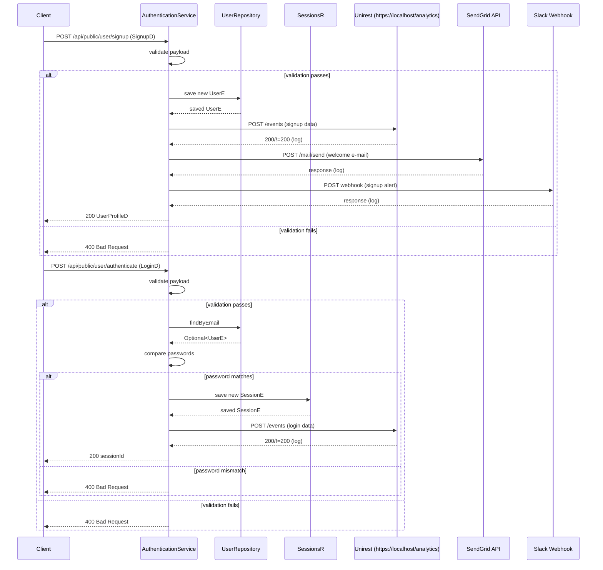

# Email Notification

## Overview
The Email Notification feature sends transactional e‑mail messages through the SendGrid service. It is invoked when a client calls the public **signup** endpoint (`POST /api/public/user/signup`) or the **authenticate** endpoint (`POST /api/public/user/authenticate`). After processing the request, the code builds a plain‑text e‑mail (from `test@privado.ai`) and posts it to SendGrid’s `mail/send` endpoint. The feature also logs an analytics event and posts a Slack notification for sign‑ups.

## Behavior
- **Trigger** – a HTTP POST to `/api/public/user/signup` (controller method `signup`) **or** `/api/public/user/authenticate` (controller method `authenticate`).  
  `src/main/java/ai/privado/demo/accounts/service/controller/AuthenticationService.java:72‑73` and `src/main/java/ai/privado/demo/accounts/service/controller/AuthenticationService.java:98‑99`
- **Input validation** – the controller checks that the request body is non‑null and that `email` and `password` (and for signup also `firstName`/`lastName`) are present and not empty/blank.  
  `AuthenticationService.java:74‑75` (signup) and `AuthenticationService.java:100‑101` (authenticate)
- **State changes**  
  * **Signup** – creates a new `UserE` entity and persists it with `UserRepository.save`.  
    `AuthenticationService.java:82‑88`  
  * **Authenticate** – looks up a user by e‑mail (`UserRepository.findByEmail`) and, on password match, creates a `SessionE` and persists it with `SessionsR.save`.  
    `AuthenticationService.java:102‑111`
- **Side‑effects** (executed only on successful validation)  
  * **Analytics event** – POSTs JSON to `https://localhost/analytics/events` via Unirest.  
    `AuthenticationService.java:90` (signup) and `AuthenticationService.java:107` (authenticate) → request built in `AuthenticationService.java:112‑119`
  * **SendGrid e‑mail** – builds a `Mail` object and calls `SendGrid.api(request)`.  
    `AuthenticationService.java:91‑93` → implementation in `AuthenticationService.sendEmail` (`AuthenticationService.java:118‑136`)  
    *A stub version exists in `SendGridStub.sendEmail` (`SendGridStub.java:21‑39`) and an async runnable in `SGSendMailJobRun.run` (`SGSendMailJobRun.java:24‑44`).*  
  * **Slack notification** – posts a message to a hard‑coded webhook URL using the Slack Java SDK.  
    `AuthenticationService.java:92‑93` → implementation in `AuthenticationService.sendSlackMessage` (`AuthenticationService.java:138‑155`)
- **Branching / error handling**  
  * If any validation fails, a `ResponseStatusException(HttpStatus.BAD_REQUEST)` is thrown, resulting in a 400 response. (`AuthenticationService.java:95` and `AuthenticationService.java:115`)  
  * If the SendGrid call throws `IOException`, the exception is caught and logged (`AuthenticationService.java:134‑136`).  
  * If the analytics HTTP call returns a status other than 200, an error is logged (`AuthenticationService.java:124‑128`).  
  * Slack errors are caught and logged (`AuthenticationService.java:149‑152`).

## Triggers / Entry points
| Entry point | Location |
|-------------|----------|
| HTTP POST `/api/public/user/signup` | `AuthenticationService.java:72‑73` |
| HTTP POST `/api/public/user/authenticate` | `AuthenticationService.java:98‑99` |
| Direct use of SendGrid stub (not wired in the current controller) | `SendGridStub.java:21‑39` |
| Async e‑mail job runnable (not currently scheduled) | `SGSendMailJobRun.java:24‑44` |

## End‑to‑end flow (Mermaid)

## State / data touched
- **User table** – `UserRepository.save` creates a new row (`AuthenticationService.java:82‑88`).  
- **Session table** – `SessionsR.save` creates a new session row (`AuthenticationService.java:109‑111`).  
- **No other persistent stores** are accessed by the e‑mail path.

## External dependencies
- **SendGrid API** – invoked via `SendGrid.api(request)` in `AuthenticationService.sendEmail` (`AuthenticationService.java:124‑130`) and in the stub / async classes (`SendGridStub.java:27‑33`, `SGSendMailJobRun.java:30‑38`).  
- **Slack webhook** – HTTP POST performed by `Slack.getInstance().send(...)` (`AuthenticationService.java:140‑148`).  
- **Analytics service** – HTTP POST via Unirest to `https://localhost/analytics/events` (`AuthenticationService.java:112‑119`).  
- **Jackson ObjectMapper** – serialises the analytics payload (`AuthenticationService.java:112‑114`).  

## Configuration / parameters
- **SendGrid API key** – hard‑coded string `"Dummy-api-key"` in each SendGrid usage (`AuthenticationService.java:124`, `SendGridStub.java:27`, `SGSendMailJobRun.java:30`).  
- **From e‑mail address** – `"test@privado.ai"` hard‑coded (`AuthenticationService.java:119`, `SendGridStub.java:22`, `SGSendMailJobRun.java:25`).  
- **Slack webhook URL** – literal URL string in `AuthenticationService.sendSlackMessage` (`AuthenticationService.java:140`).  
- **Analytics base URL** – literal `"https://localhost/analytics"` in `AuthenticationService.sendEvent` (`AuthenticationService.java:108`).  

## Edge cases & failure modes (observed in code)
- **Missing/empty fields** → immediate `ResponseStatusException(HttpStatus.BAD_REQUEST)` (signup line 95, authenticate line 115).  
- **User not found or password mismatch** → falls through to the same 400 response (authenticate line 108‑114).  
- **SendGrid `IOException`** → caught and logged; the request still returns success to the client because the exception does not propagate (`AuthenticationService.java:134‑136`).  
- **Analytics HTTP non‑200** → logged as error but does not affect client response (`AuthenticationService.java:124‑128`).  
- **Slack posting exception** → caught and logged (`AuthenticationService.java:149‑152`).  

## Open questions
- **How are `SendGridStub` and `SGSendMailJobRun` intended to be used?**  
  They contain duplicate SendGrid logic but are never referenced from the controller or any other class in the provided sources.  
- **Is there any retry or back‑off logic for SendGrid / Slack / Analytics calls?**  
  The current code logs the exception but does not retry.  
- **Where does the `SendGridStub` instance (`sgStub`) injected into the controller get used?**  
  No call to `sgStub.sendEmail(...)` appears in the shown methods.  
- **Are there any feature flags or environment variables that could override the hard‑coded API key, webhook URL, or analytics base URL?**  
  The code contains a `TODO` comment about pulling the analytics URL from `application.properties`, but the actual mechanism is not present.  

---