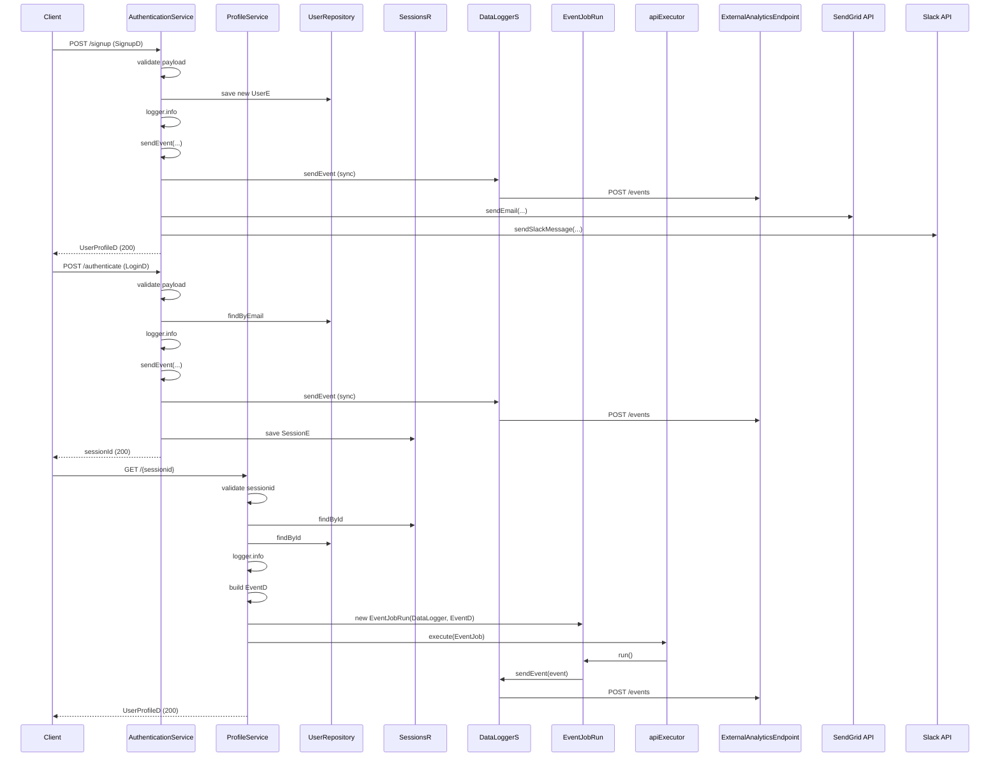

# Event Logging / Analytics

## Overview
The Event Logging / Analytics feature records business‑level actions (signup, login, profile view) and forwards them to an external analytics endpoint as well as to third‑party analytics services. The feature is invoked directly by HTTP controllers when a user signs up, authenticates, or retrieves a profile. For each action an `EventD` payload is built and sent to the analytics endpoint; additional side‑effects such as welcome e‑mail, Slack notification, and asynchronous logging are also performed.

## Behavior
- **Trigger:** `POST /api/public/user/signup` invokes `AuthenticationService.signup` (`src/main/java/ai/privado/demo/accounts/service/controller/AuthenticationService.java:72`).  
- **Input validation:** The method checks that the `SignupD` body, its `email` and `password` fields are non‑null and non‑empty (`:74‑75`).  
- **State change:** A new `UserE` entity is populated and persisted via `userr.save(us)` (`:88`).  
- **Side‑effects:**  
  - Calls `sendEvent(UUID.randomUUID().toString(), "SIGNUP", email + phone)` which serialises the event data and POSTs it to `https://localhost/analytics/events` using Unirest (`src/main/java/ai/privado/demo/accounts/service/controller/AuthenticationService.java:154‑162`).  
  - Sends a welcome e‑mail via SendGrid (`sendEmail` → Unirest‑like call to SendGrid API, lines `118‑136`).  
  - Posts a Slack message via the Slack SDK (`sendSlackMessage`, lines `139‑148`).  
- **Response:** Returns a mapped `UserProfileD` (`mapper.map(saved, UserProfileD.class)`, line `93`).  
- **Failure branch:** If validation fails, a `ResponseStatusException(HttpStatus.BAD_REQUEST)` is thrown (`:95`). Event‑logging failures only generate error logs (`:163‑166`).

- **Trigger:** `POST /api/public/user/authenticate` invokes `AuthenticationService.authenticate` (`src/main/java/ai/privado/demo/accounts/service/controller/AuthenticationService.java:98`).  
- **Input validation:** Checks that `LoginD` and its `email`/`password` are present and non‑blank (`:100‑101`).  
- **State change:** On successful password match, creates a `SessionE` and persists it via `sesr.save(ses)` (`:111`).  
- **Side‑effects:** Calls `sendEvent(UUID.randomUUID().toString(), "LOGIN", ...)` which posts the login event to the analytics endpoint (`:154‑162`).  
- **Response:** Returns the newly created session ID (`:112`).  
- **Failure branch:** Invalid input or authentication failure results in `ResponseStatusException(HttpStatus.BAD_REQUEST)` (`:115`).

- **Trigger:** `GET /api/user/{sessionid}` invokes `ProfileService.getProfile` (`src/main/java/ai/privado/demo/accounts/service/controller/ProfileService.java:54`).  
- **Input validation:** Ensures `sessionid` is non‑null and not blank (`:56`).  
- **State read:** Retrieves the `SessionE` (`sesr.findById(sessionid)`, line `57`) and then the associated `UserE` (`userr.findById(...)`, line `60`).  
- **Side‑effects:**  
  - Constructs an `EventD` with a new UUID, event name `GET_PROFILE`, and JSON‑serialised user data (`:63‑66`).  
  - Wraps the event in an `EventJobRun` and submits it to the injected `apiExecutor` (`apiExecutor.execute(ejr)`, line `68`). The runnable later calls `DataLoggerS.sendEvent(event)` which POSTs the payload to the same analytics endpoint (`src/main/java/ai/privado/demo/accounts/apistubs/DataLoggerS.java:22‑28`).  
- **Response:** Returns a mapped `UserProfileD` (`mapper.map(usre.get(), UserProfileD.class)`, line `73`).  
- **Failure branch:** Any missing or blank `sessionid`, or absent session/user records, leads to `ResponseStatusException(HttpStatus.BAD_REQUEST)` (`:77`).

## Triggers / Entry points
- `src/main/java/ai/privado/demo/accounts/service/controller/AuthenticationService.java:72` – POST **/api/public/user/signup**  
- `src/main/java/ai/privado/demo/accounts/service/controller/AuthenticationService.java:98` – POST **/api/public/user/authenticate**  
- `src/main/java/ai/privado/demo/accounts/service/controller/ProfileService.java:54` – GET **/api/user/{sessionid}**  

## End-to‑to‑flow (Mermaid)

## State / data touched
- **User table** – `userr.save(us)` creates a new user record (`AuthenticationService.java:88`).  
- **Session table** – `sesr.save(ses)` creates a new session record (`AuthenticationService.java:111`).  
- **Read operations** – `sesr.findById(sessionid)` (`ProfileService.java:57`) and `userr.findById(userId)` (`ProfileService.java:60`).  

## External dependencies
- **Analytics endpoint** – HTTP POST to `https://localhost/analytics/events` via Unirest in two places:  
  - Synchronous call in `AuthenticationService.sendEvent` (`AuthenticationService.java:160‑162`).  
  - Asynchronous call in `DataLoggerS.sendEvent` (`DataLoggerS.java:27‑28`).  
- **SendGrid** – E‑mail delivery using the SendGrid SDK (`AuthenticationService.sendEmail`, lines `124‑130`).  
- **Slack** – Message posting via Slack SDK (`AuthenticationService.sendSlackMessage`, lines `142‑148`).  
- **Third‑party analytics libraries** are declared in `AnalyticsStub` but are not invoked by the current code paths.

## Configuration / parameters
- **Analytics base URL** – hard‑coded as `https://localhost/analytics` in both `AuthenticationService.sendEvent` (`:155`) and `DataLoggerS.baseURL` (`DataLoggerS.java:20`).  
- **SendGrid API key** – placeholder `"Dummy-api-key"` used when constructing `SendGrid` (`AuthenticationService.java:124`).  
- **Slack webhook URL** – hard‑coded string in `AuthenticationService.sendSlackMessage` (`:140`).  
- **Third‑party service keys** – constants in `AnalyticsStub` (`AnalyticsService.java:23‑25`) but not used in the active flow.

## Edge cases & failure modes (observed in code)
- **Input validation failures** – missing/blank email, password, or session ID cause an immediate `ResponseStatusException(HttpStatus.BAD_REQUEST)` (`AuthenticationService.java:95`, `AuthenticationService.java:115`, `ProfileService.java:77`).  
- **Analytics endpoint non‑200 response** – logs an error (`AuthenticationService.java:163‑165`, `DataLoggerS.java:30‑31`) but does not abort the primary request.  
- **Exceptions during external calls** – `UnirestException` / `IOException` in `sendEvent` are caught and logged (`AuthenticationService.java:168‑170`).  
- **Email/Slack failures** – caught and logged (`sendEmail` catch block `:134‑136`; `sendSlackMessage` catch block `:149‑150`).  

## Open questions
- **How is `apiExecutor` configured?** The bean is injected with qualifier `"ApiCaller"` but the concrete thread‑pool settings are not visible in the provided sources.  
- **Is `DataLoggerS` a Spring component?** It is instantiated and injected, yet the class lacks `@Component`/`@Service` annotations; its lifecycle is unclear.  
- **Are the third‑party analytics libraries (`AnalyticsStub`) ever used?** The class defines `trackEvent` but no controller or service