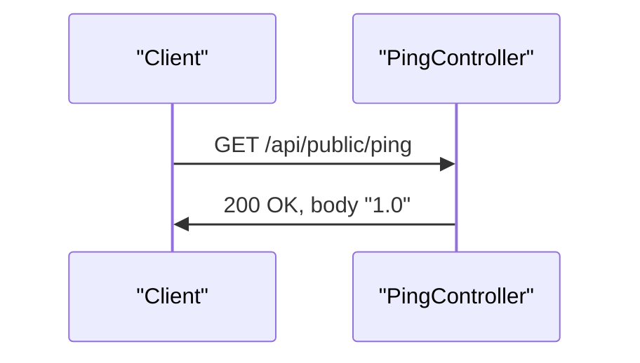

# Health Check / Ping

## Overview
The Health Check / Ping feature provides a lightweight HTTP endpoint that confirms the service is running and reports its version. When a client sends an HTTP GET request to `/api/public/ping`, the controller returns the static string `"1.0"` as the response body. This endpoint is typically used by monitoring tools or other services to verify availability without invoking any business logic.

The request is handled entirely by the `Ping` controller class; no request parameters are required, no validation is performed, and no external resources are accessed. The response is a plain text payload containing the hard‑coded version identifier.

## Behavior
- **Trigger** – An HTTP GET request to the path `/api/public/ping` invokes the controller method (`src/main/java/ai/privado/demo/accounts/service/controller/Ping.java:6`).  
- **Inputs** – The endpoint accepts no query parameters, path variables, or request bodies; therefore there is no input validation (`src/main/java/ai/privado/demo/accounts/service/controller/Ping.java:7‑10`).  
- **State/Data** – The method does not read from or write to any application state, database, cache, or file system (`src/main/java/ai/privado/demo/accounts/service/controller/Ping.java:9`).  
- **Output** – The method returns the literal string `"1.0"` as the HTTP response body (`src/main/java/ai/privado/demo/accounts/service/controller/Ping.java:9`).  
- **Side‑effects** – No side‑effects, notifications, or asynchronous work are performed.  
- **Branches** – The implementation contains a single, unconditional return statement; there are no conditional branches, validation failures, or downstream calls (`src/main/java/ai/privado/demo/accounts/service/controller/Ping.java:9`).

## Triggers / Entry points
- **HTTP GET `/api/public/ping`** – Mapped by `@RequestMapping("/api/public/ping")` on the class and `@GetMapping` on the method (`src/main/java/ai/privado/demo/accounts/service/controller/Ping.java:5‑8`).

## End-to-end flow (Mermaid)

## State / data touched
- None. The controller does not interact with any tables, collections, caches, or files (`src/main/java/ai/privado/demo/accounts/service/controller/Ping.java:9`).

## External dependencies
- None. The method does not call any other services, APIs, message brokers, or external libraries beyond the Spring MVC annotations used for routing (`src/main/java/ai/privado/demo/accounts/service/controller/Ping.java`).

## Configuration / parameters
- None. The version string is hard‑coded; there are no environment variables, feature flags, or configuration properties influencing the behavior (`src/main/java/ai/privado/demo/accounts/service/controller/Ping.java:9`).

## Edge cases & failure modes (observed in code)
- None. Because the method always returns a constant string and performs no I/O, there are no observable failure modes, retries, timeouts, or validation errors.

## Open questions
- **Dynamic versioning** – The version is currently a literal `"1.0"`; it is unclear whether future revisions will externalize this value (e.g., from a properties file or build metadata). No code currently indicates such a mechanism.  
- **Health semantics** – The endpoint returns only a version string; it does not perform any health checks (e.g., database connectivity, downstream service reachability). If broader health information is required, additional implementation would be needed, but the current source does not reveal any such intent.