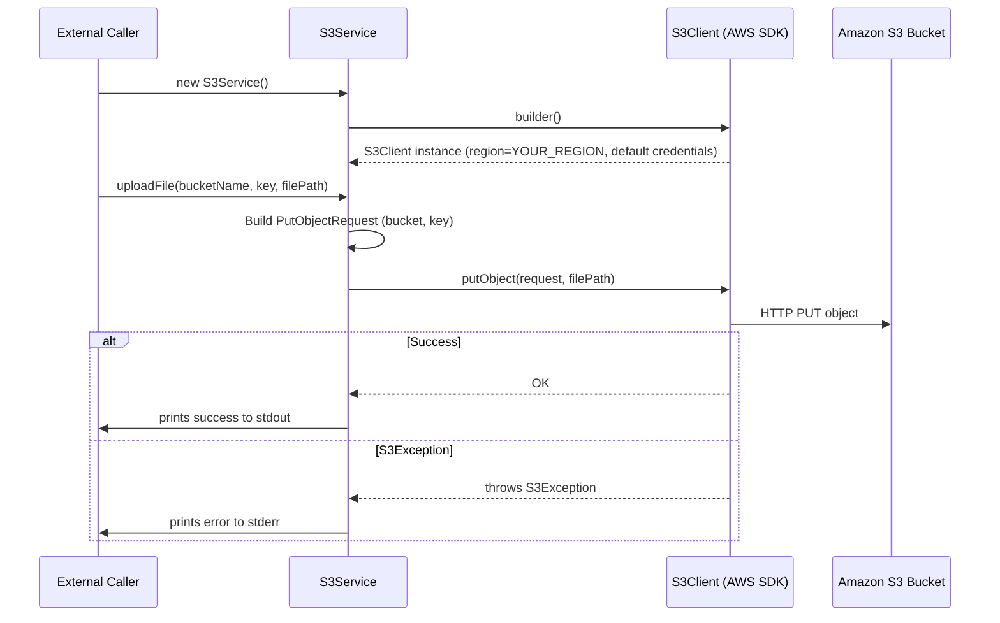

# S3 File Storage

## Overview
The S3 File Storage feature uploads a local file to an Amazon S3 bucket. It is activated when client code calls the `uploadFile` method of the `S3Service` class defined in `src/main/java/ai/privado/demo/accounts/thirdparty/S3stub.java`. The method builds an S3 `PutObjectRequest`, sends it via the AWS SDK `S3Client`, and writes a success message to standard output; if the SDK throws an `S3Exception`, the error message is written to standard error.

## Behavior
- **Trigger** – The feature starts when `uploadFile` is invoked (`src/main/java/ai/privado/demo/accounts/thirdparty/S3stub.java:21`).  
- **Inputs** – It receives three parameters: `bucketName` (`String`), `key` (`String`), and `file` (`Path`) (`src/main/java/ai/privado/demo/accounts/thirdparty/S3stub.java:21`). No explicit validation of these arguments is performed in the method.  
- **State / data read** –  
  - Reads the already‑constructed `S3Client` stored in the `s3` field (`src/main/java/ai/privado/demo/accounts/thirdparty/S3stub.java:12`).  
  - Builds a `PutObjectRequest` using the supplied `bucketName` and `key` (`src/main/java/ai/privado/demo/accounts/thirdparty/S3stub.java:23‑26`).  
- **External call / side‑effect** – Calls `s3.putObject(putObjectRequest, file)` which streams the file to the target S3 bucket (`src/main/java/ai/privado/demo/accounts/thirdparty/S3stub.java:27`).  
- **Outputs** –  
  - On success, prints `File uploaded successfully to S3 bucket: <bucketName>` to `System.out` (`src/main/java/ai/privado/demo/accounts/thirdparty/S3stub.java:28`).  
  - On failure, catches `S3Exception` and prints the AWS error message to `System.err` (`src/main/java/ai/privado/demo/accounts/thirdparty/S3stub.java:29‑30`).  
- **Branches** – The `try … catch` creates two distinct paths:  
  - **Success path** – execution reaches line 28 and returns normally.  
  - **Error path** – an `S3Exception` is thrown, caught at line 29, and the error is logged at line 30.

## Triggers / Entry points
- Construction of `S3Service` creates the `S3Client` (`src/main/java/ai/privado/demo/accounts/thirdparty/S3stub.java:14‑19`).  
- The public method `uploadFile` is the operational entry point (`src/main/java/ai/privado/demo/accounts/thirdparty/S3stub.java:21‑32`).  

## End-to-end flow (Mermaid)

## State / data touched
- **In‑memory field** `s3` holding the `S3Client` instance (`src/main/java/ai/privado/demo/accounts/thirdparty/S3stub.java:12`).  
- **Transient request object** `PutObjectRequest` built per call (`src/main/java/ai/privado/demo/accounts/thirdparty/S3stub.java:23‑26`).  
- **Console output** – writes a success line (`System.out.println`) or an error line (`System.err.println`) (`src/main/java/ai/privado/demo/accounts/thirdparty/S3stub.java:28,30`).  

## External dependencies
- **AWS SDK S3Client** – created with `S3Client.builder()` (`src/main/java/ai/privado/demo/accounts/thirdparty/S3stub.java:15‑18`).  
- **DefaultCredentialsProvider** – supplies AWS credentials (`src/main/java/ai/privado/demo/accounts/thirdparty/S3stub.java:17`).  
- **Region.YOUR_REGION** – selects the AWS region for the client (`src/main/java/ai/privado/demo/accounts/thirdparty/S3stub.java:16`).  
- **PutObjectRequest** – models the S3 PUT operation (`src/main/java/ai/privado/demo/accounts/thirdparty/S3stub.java:23‑26`).  
- **S3Exception** – caught to surface AWS error details (`src/main/java/ai/privado/demo/accounts/thirdparty/S3stub.java:29‑30`).  

## Configuration / parameters
- **Region constant** – `Region.YOUR_REGION` is hard‑coded in the builder (`src/main/java/ai/privado/demo/accounts/thirdparty/S3stub.java:16`).  
- **Credentials provider** – uses `DefaultCredentialsProvider.create()` which reads credentials from the default AWS provider chain (`src/main/java/ai/privado/demo/accounts/thirdparty/S3stub.java:17`).  

## Edge cases & failure modes (observed in code)
- **AWS service errors** – any `S3Exception` thrown by `s3.putObject` is caught and its message is printed (`src/main/java/ai/privado/demo/accounts/thirdparty/S3stub.java:29‑30`).  
- **No input validation** – the method does not check for null or empty `bucketName`, `key`, or `file`; such errors would surface as `NullPointerException` or SDK errors, but they are not explicitly handled.  

## Open questions
- **Invocation context** – The source does not show which component or controller calls `uploadFile`; the caller is unknown.  
- **Lifecycle of `close()`** – The `close` method (`src/main/java/ai/privado/demo/accounts/thirdparty/S3stub.java:34‑36`) is defined but never referenced; it is unclear when or if the client is closed.  
- **Production region configuration** – The placeholder `Region.YOUR_REGION` suggests a need for runtime configuration, but the mechanism (environment variable, property file, etc.) is not present in the shown code.  
- **Error handling strategy** – Beyond printing to `stderr`, there is no retry, back‑off, or propagation of the exception; the broader system’s response to upload failures is unknown.