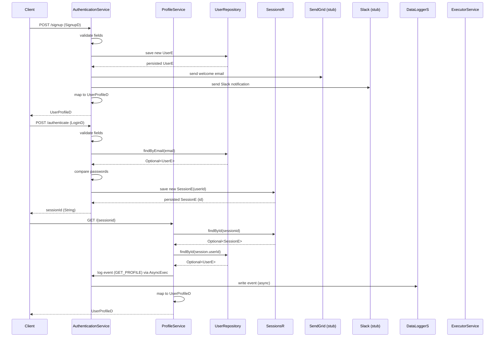

# Session Management

## Overview
The Session Management feature creates, stores, and looks up user sessions at runtime. It is invoked when a client calls the public authentication endpoints (`/api/public/user/signup` and `/api/public/user/authenticate`) or the protected profile endpoint (`/api/user/{sessionid}`). The feature persists a `SessionE` record that links a generated session identifier to a user identifier, returns that identifier to the caller, and uses it later to retrieve the associated user profile.

## Behavior
- **Trigger** – A POST to **/api/public/user/signup** invokes `AuthenticationService.signup` (`src/main/java/ai/privado/demo/accounts/service/controller/AuthenticationService.java:45`).  
- **Trigger** – A POST to **/api/public/user/authenticate** invokes `AuthenticationService.authenticate` (`src/main/java/ai/privado/demo/accounts/service/controller/AuthenticationService.java:78`).  
- **Trigger** – A GET to **/api/user/{sessionid}** invokes `ProfileService.getProfile` (`src/main/java/ai/privado/demo/accounts/service/controller/ProfileService.java:42`).  

### Signup flow
- Validates that `signup.email` and `signup.password` are non‑null and non‑empty (`AuthenticationService.java:48‑52`).  
- Constructs a new `UserE`, sets its fields, and persists it with `userRepository.save` (`AuthenticationService.java:55‑61`).  
- Logs the signup event, sends a welcome email (`AuthenticationService.sendEmail` – lines 121‑133) and a Slack notification (`AuthenticationService.sendSlackMessage` – lines 105‑119).  
- Returns a `UserProfileD` mapped from the saved `UserE` (`AuthenticationService.java:64‑66`).  

### Authentication flow
- Validates that `login.email` and `login.password` are present and non‑blank (`AuthenticationService.java:84‑87`).  
- Looks up the user by email with `userRepository.findByEmail` (`AuthenticationService.java:89`).  
- If a matching user exists and the password matches, creates a new `SessionE`, sets its `userId` to the user’s primary key, and persists it with `sessionsRepository.save` (`AuthenticationService.java:90‑92`).  
- Returns the generated session identifier (`SessionE.id`) to the caller (`AuthenticationService.java:93`).  

### Profile retrieval flow
- Validates that the supplied `sessionid` path variable is non‑null and non‑blank (`ProfileService.java:44`).  
- Retrieves the `SessionE` by its id with `sessionsRepository.findById` (`ProfileService.java:46‑48`).  
- If the session exists, fetches the associated `UserE` via `userRepository.findById` (`ProfileService.java:49‑51`).  
- Logs the profile fetch event and schedules an asynchronous `EventJobRun` that writes the event to the data‑logger (`ProfileService.java:53‑58`).  
- Returns a `UserProfileD` mapped from the `UserE` (`ProfileService.java:60‑61`).  

### Failure handling
- If any validation fails, a `ResponseStatusException(HttpStatus.BAD_REQUEST)` is thrown (`AuthenticationService.java:66`, `AuthenticationService.java:95`, `ProfileService.java:63`).  
- If the user lookup fails or the password does not match, the same `BAD_REQUEST` exception is raised (`AuthenticationService.java:95`).  
- If the session lookup fails, the profile endpoint also throws `BAD_REQUEST` (`ProfileService.java:63`).  
- Event‑logging failures are logged but do not abort the main flow (`AuthenticationService.java:136‑143`).  

## Triggers / Entry points
| Route | HTTP Method | Controller | Method |
|-------|-------------|------------|--------|
| `/api/public/user/signup` | POST | `AuthenticationService` | `signup` (`AuthenticationService.java:45`) |
| `/api/public/user/authenticate` | POST | `AuthenticationService` | `authenticate` (`AuthenticationService.java:78`) |
| `/api/user/{sessionid}` | GET | `ProfileService` | `getProfile` (`ProfileService.java:42`) |

## End‑to‑end flow (Mermaid)

## State / data touched
- **Table `SESSIONS`** – persisted by `SessionE` (`SessionE.java:7‑15`).  
- **`SessionE` entity** – holds `id` (inherited from `BaseE`) and `userId` column (`SessionE.java:13‑19`).  
- **`SessionsR` repository** – used to `save`, `findById`, and `findById` for sessions (`AuthenticationService.java:90‑92`, `ProfileService.java:46‑48`).  
- **`UserE` entity** – created/updated during signup (`AuthenticationService.java:55‑61`).  
- **`UserRepository`** – `save`, `findByEmail`, `findById` (`AuthenticationService.java:55‑61`, `AuthenticationService.java:89`, `ProfileService.java:49‑51`).  

## External dependencies
- **SendGrid** – invoked in `AuthenticationService.sendEmail` to POST the email payload (`AuthenticationService.java:121‑133`).  
- **Slack** – invoked in `AuthenticationService.sendSlackMessage` to POST the message (`AuthenticationService.java:105‑119`).  
- **Analytics endpoint** – HTTP POST to `https://localhost/analytics/events` in `AuthenticationService.sendEvent` (`AuthenticationService.java:136‑143`).  
- **Async executor** – `apiExecutor.execute(new EventJobRun(...))` schedules the logging job (`ProfileService.java:55‑58`).  

## Configuration / parameters
- **Analytics base URL** – hard‑coded as `https://localhost/analytics` in `AuthenticationService.sendEvent` (`AuthenticationService.java:136`).  
- **SendGrid API key** – hard‑coded as `"Dummy-api-key"` in `AuthenticationService.sendEmail` (`AuthenticationService.java:115`).  
- **Slack webhook URL** – hard‑coded in `AuthenticationService.sendSlackMessage` (`AuthenticationService.java:107`).  

## Edge cases & failure modes (observed in code)
- **Missing or empty signup fields** → `BAD_REQUEST` (`AuthenticationService.java:48‑52`).  
- **Missing or empty login fields** → `BAD_REQUEST` (`AuthenticationService.java:84‑87`).  
- **User not found or password mismatch** → `BAD_REQUEST` (`AuthenticationService.java:95`).  
- **Session id missing/blank** → `BAD_REQUEST` (`ProfileService.java:44`).  
- **Session not found** → `BAD_REQUEST` (`ProfileService.java:63`).  
- **Event‑logging HTTP error (non‑200)** → logged as error but does not affect response (`AuthenticationService.java:138‑141`).  
- **Email or Slack send failures** → caught, logged, and execution continues (`AuthenticationService.java:124‑132`, `AuthenticationService.java:110‑118`).  

## Open questions
- **Retry / compensation for external calls** – The code logs failures from SendGrid, Slack, and the analytics POST but does not show any retry or fallback logic. It is unclear whether retries are handled elsewhere (e.g., by a wrapper or external library).  
- **Session expiration / cleanup** – The `SessionE` entity contains only `id` and `userId`; there is no timestamp or TTL field visible, and no cleanup job is referenced. How sessions are eventually invalidated is not evident from the provided sources.  
- **Configuration source for URLs and keys** – The analytics base URL, SendGrid API key, and Slack webhook are hard‑coded. If they are overridden via Spring properties or environment variables, that mechanism is not visible in the current files.  
- **Concurrency handling for session creation** – The repository `save` call is used directly; any uniqueness constraints or race‑condition handling are not shown.  

---