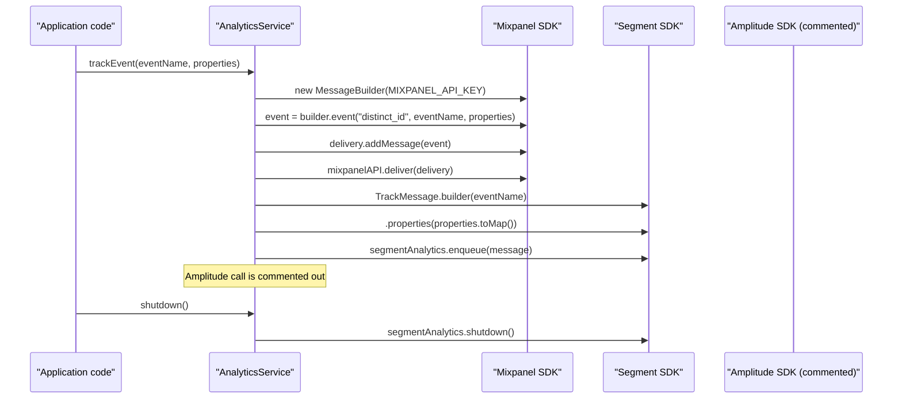

# Third‑Party Analytics Integration

## Overview
The Third‑Party Analytics Integration feature wraps three external analytics services—Mixpanel, Segment, and Amplitude—and provides a single method, `trackEvent`, that sends an event name together with a set of properties to each service. The feature is instantiated by creating an `AnalyticsService` object (constructor at `src/main/java/ai/privado/demo/accounts/thirdparty/AnalyticsStub.java:21‑24`). When client code calls `trackEvent`, the service builds the appropriate payloads and forwards them to the external SDKs. A `shutdown` method is also provided to cleanly stop the Segment client (`src/main/java/ai/privado/demo/accounts/thirdparty/AnalyticsStub.java:42‑44`).

## Behavior
- **Trigger** – The flow starts when `trackEvent(String eventName, JSONObject properties)` is invoked (`src/main/java/ai/privado/demo/accounts/thirdparty/AnalyticsStub.java:26`).  
- **Inputs** – `eventName` (a non‑null `String`) and `properties` (a `org.json.JSONObject`). No explicit validation is performed; the method assumes both arguments are provided (`src/main/java/ai/privado/demo/accounts/thirdparty/AnalyticsStub.java:26‑27`).  
- **State read** –  
  * API keys are read from the static constants `MIXPANEL_API_KEY`, `SEGMENT_WRITE_KEY`, and `AMPLITUDE_API_KEY` (`src/main/java/ai/privado/demo/accounts/thirdparty/AnalyticsStub.java:11‑13`).  
  * The `MixpanelAPI` and `Analytics` client instances created in the constructor are reused (`src/main/java/ai/privado/demo/accounts/thirdparty/AnalyticsStub.java:22‑23`).  
- **Mixpanel handling** –  
  * A `MessageBuilder` is created with the Mixpanel key (`src/main/java/ai/privado/demo/accounts/thirdparty/AnalyticsStub.java:28`).  
  * An event JSON object is built using a hard‑coded `"distinct_id"` together with the supplied `eventName` and `properties` (`src/main/java/ai.privado/demo/accounts/thirdparty/AnalyticsStub.java:29`).  
  * The event is added to a `ClientDelivery` and delivered via `mixpanelAPI.deliver` (`src/main/java/ai.privado/demo/accounts/thirdparty/AnalyticsStub.java:30‑32`).  
- **Segment handling** –  
  * A `TrackMessage` is built from `eventName` and the properties converted to a `Map` (`src/main/java/ai.privado/demo/accounts/thirdparty/AnalyticsStub.java:34‑35`).  
  * The message is enqueued on the Segment client (`segmentAnalytics.enqueue`) (`src/main/java/ai.privado/demo/accounts/thirdparty/AnalyticsStub.java:34‑35`).  
- **Amplitude handling** – The code contains a commented‑out call to `Amplitude.getInstance().logEvent` (`src/main/java/ai.privado/demo/accounts/thirdparty/AnalyticsStub.java:36‑37`). No runtime action occurs.  
- **Side‑effects** – Network calls are made to Mixpanel and Segment endpoints; the method does not return a value.  
- **Shutdown** – When `shutdown()` is called, the Segment client is gracefully stopped (`src/main/java/ai.privado/demo/accounts/thirdparty/AnalyticsStub.java:43`).  

## Triggers / Entry points
- Direct invocation of `AnalyticsService.trackEvent(...)` from any application code (`src/main/java/ai/privado/demo/accounts/thirdparty/AnalyticsStub.java:26`).  
- Invocation of `AnalyticsService.shutdown()` when the application is terminating (`src/main/java/ai/privado/demo/accounts/thirdparty/AnalyticsStub.java:42`).

## End-to-end flow (Mermaid)

## State / data touched
- **Constants** – `MIXPANEL_API_KEY`, `SEGMENT_WRITE_KEY`, `AMPLITUDE_API_KEY` (`src/main/java/ai/privado/demo/accounts/thirdparty/AnalyticsStub.java:11‑13`).  
- **In‑memory objects** – `mixpanelAPI` and `segmentAnalytics` client instances created in the constructor (`src/main/java/ai.privado/demo/accounts/thirdparty/AnalyticsStub.java:22‑23`).  
- **Event payload** – The JSON object built for Mixpanel (`src/main/java/ai.privado/demo/accounts/thirdparty/AnalyticsStub.java:29`) and the `Map` derived from `properties` for Segment (`src/main/java/ai.privado/demo/accounts/thirdparty/AnalyticsStub.java:35`).  

## External dependencies
- **Mixpanel SDK** – `MessageBuilder`, `ClientDelivery`, and `MixpanelAPI` classes are used to send the event (`src/main/java/ai/privado/demo/accounts/thirdparty/AnalyticsStub.java:28‑32`).  
- **Segment SDK** – `Analytics` builder and `TrackMessage` are used to enqueue the event (`src/main/java/ai/privado/demo/accounts/thirdparty/AnalyticsStub.java:23,34‑35`).  
- **Amplitude SDK** – Imported but not invoked; the call is commented out (`src/main/java/ai.privado/demo/accounts/thirdparty/AnalyticsStub.java:36‑37`).  

## Configuration / parameters
- `MIXPANEL_API_KEY` – static constant holding the Mixpanel project token (`src/main/java/ai/privado/demo/accounts/thirdparty/AnalyticsStub.java:11`).  
- `SEGMENT_WRITE_KEY` – static constant holding the Segment write key (`src/main/java/ai/privado/demo/accounts/thirdparty/AnalyticsStub.java:12`).  
- `AMPLITUDE_API_KEY` – static constant for Amplitude (currently unused) (`src/main/java/ai/privado/demo/accounts/thirdparty/AnalyticsStub.java:13`).  

## Edge cases & failure modes (observed in code)
- No explicit validation of `eventName` or `properties`; a `null` value would cause a `NullPointerException` when `properties.toMap()` is called (`src/main/java/ai/privado/demo/accounts/thirdparty/AnalyticsStub.java:35`).  
- No error handling or retry logic around the Mixpanel `deliver` call or Segment `enqueue` call; any exception propagates to the caller.  
- The comment suggests asynchronous execution may be desirable, but the current implementation runs synchronously (`src/main/java/ai.privado/demo/accounts/thirdparty/AnalyticsStub.java:38`).  

## Open questions
- **Caller context** – Which parts of the application actually invoke `trackEvent`? The source does not show any controller, service, or UI code that calls it.  
- **Distinct ID source** – The Mixpanel event uses a hard‑coded `"distinct_id"` string (`src/main/java/ai.privado/demo/accounts/thirdparty/AnalyticsStub.java:29`). It is unclear whether this should be replaced with a real user identifier.  
- **API key provisioning** – The constants contain placeholder strings (`"YOUR_MIXPANEL_API_KEY"` etc.). The code does not demonstrate reading them from environment variables or a configuration service, despite the comment on line 10.  
- **Failure handling** – How does the broader system react if Mixpanel or Segment throws an exception? No try/catch blocks are present.  
- **Amplitude activation** – The Amplitude call is commented out; it is unknown whether a future version will enable it and what additional initialization would be required.  
- **Threading / async** – The comment on line 38 mentions possible asynchronous execution, but the current implementation is synchronous; the intended concurrency model is not defined.  
- **Shutdown timing** – When is `shutdown()` expected to be called in the application lifecycle? No lifecycle hooks are shown.