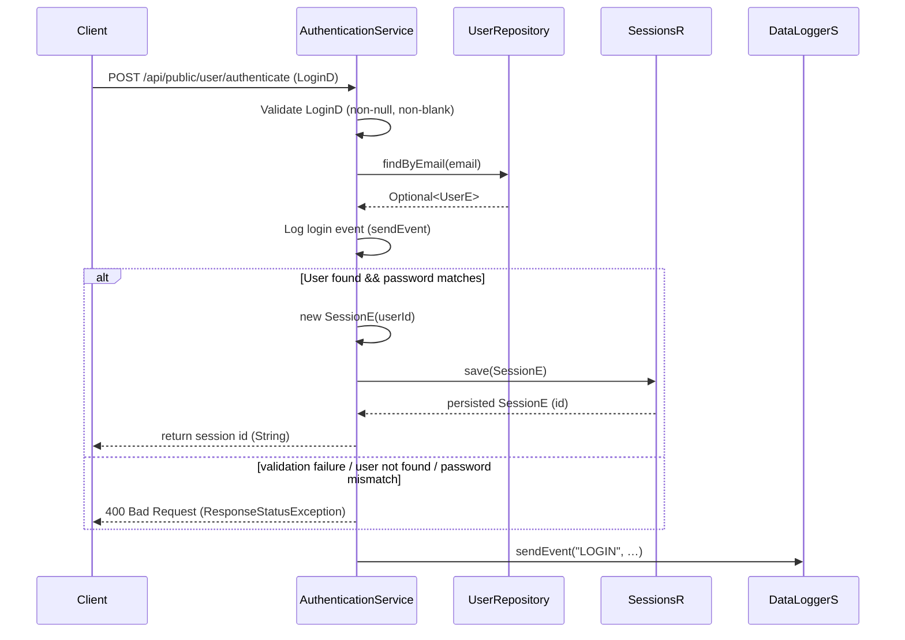

# User Login

## Overview
The User Login feature validates a user’s email and password and, when the credentials are correct, creates a new session record and returns its identifier as a session token. The flow is initiated by an HTTP POST request to the public authentication endpoint. The `AuthenticationService` controller orchestrates the lookup of the user, password comparison, session creation, and logging of the login event.

## Behavior
- **Trigger** – A POST request to `/api/public/user/authenticate` with a JSON body mapped to `LoginD`. [`src/main/java/ai/privado/demo/accounts/service/controller/AuthenticationService.java:43`]
- **Input validation** – The method checks that the `LoginD` object is non‑null and that both `email` and `password` are non‑blank strings. [`src/main/java/ai.privado.demo.accounts.service.controller/AuthenticationService.java:44-45`]
- **Read user data** – Calls `userr.findByEmail(email)` to retrieve an optional `UserE`. [`src/main/java/ai.privado.demo.accounts.service.controller/AuthenticationService.java:47`]
- **Log login request** – Sends a “LOGIN” event to the analytics service via `sendEvent`. [`src/main/java/ai.privado.demo.accounts.service.controller/AuthenticationService.java:49-50`]
- **Password check** – If a user is found and the supplied password equals the stored password, execution proceeds; otherwise the method falls through to the error case. [`src/main/java/ai.privado.demo.accounts.service.controller/AuthenticationService.java:54-55`]
- **Create session** – Instantiates a `SessionE`, sets its `userId` to the found user’s ID, and persists it with `sesr.save(ses)`. [`src/main/java/ai.privado.demo.accounts.service.controller/AuthenticationService.java:54-56`]
- **Output** – Returns the newly created session’s ID (`ses.getId()`) as a plain string response. [`src/main/java/ai.privado.demo.accounts.service.controller/AuthenticationService.java:57`]
- **Failure path** – If any validation fails, the user is not found, or the password does not match, a `ResponseStatusException` with HTTP 400 Bad Request is thrown. [`src/main/java/ai.privado.demo.accounts.service.controller/AuthenticationService.java:59`]

## Triggers / Entry points
- **POST `/api/public/user/authenticate`** – mapped to `AuthenticationService.authenticate`. [`src/main/java/ai.privado.demo.accounts.service.controller/AuthenticationService.java:43`]

## End-to-end flow (Mermaid)

## State / data touched
- **`UserE` table** – read to locate a user by email. [`src/main/java/ai.privado.demo.accounts.service.controller/AuthenticationService.java:47`]
- **`SESSIONS` table (`SessionE`)** – a new row is inserted for the successful login. [`src/main/java/ai.privado.demo.accounts.service.controller/AuthenticationService.java:54-56`]

## External dependencies
- **`UserRepository`** – JPA repository used to query users by email. [`src/main/java/ai.privado.demo.accounts.service.controller/AuthenticationService.java:47`]
- **`SessionsR`** – JPA repository used to persist a new session record. [`src/main/java/ai.privado.demo.accounts.service.controller/AuthenticationService.java:54-56`]
- **`DataLoggerS.sendEvent`** – invoked to post a login event to the analytics endpoint (`https://localhost/analytics/events`). [`src/main/java/ai.privado.demo.accounts.service.controller/AuthenticationService.java:49-50`]
- **Unirest (via `DataLoggerS`)** – performs the HTTP POST to the analytics service. [`src/main/java/ai/privado/demo/accounts/apistubs/DataLoggerS.java:15-22`]

## Configuration / parameters
- **Analytics base URL** – hard‑coded as `https://localhost/analytics` inside `DataLoggerS` and `AuthenticationService.sendEvent`. [`src/main/java/ai/privado/demo/accounts/apistubs/DataLoggerS.java:13`], [`src/main/java/ai/privado/demo/accounts/service/controller/AuthenticationService.java:61`]
- No environment variables, feature flags, or external configuration keys are referenced in the login flow.

## Edge cases & failure modes (observed in code)
- **Input validation failure** – missing or blank email/password results in a 400 response. [`src/main/java/ai.privado.demo.accounts.service.controller/AuthenticationService.java:44-45`]
- **User not found / password mismatch** – also leads to a 400 response (same exception). [`src/main/java/ai.privado.demo.accounts.service.controller/AuthenticationService.java:54-55`]
- **Analytics event failure** – `sendEvent` catches `UnirestException`/`IOException` and logs an error but does not affect the login response. [`src/main/java/ai.privado.demo.accounts.service.controller/AuthenticationService.java:66-71`]

## Open questions
- **Session expiration / revocation** – The `SessionE` entity does not expose fields for expiry or status, and the code does not set any TTL. It is unclear how session lifetime is managed. (See `SessionE` definition – no expiration fields.)  
- **Password storage** – Passwords are compared with plain‑text equality (`login.getPassword().equals(resp.get().getPassword())`). It is unclear whether passwords are hashed elsewhere or stored in plain text. (See password comparison line.)  
- **Error handling for repository failures** – The code does not catch exceptions from `userr.findByEmail` or `sesr.save`. It is unknown how database errors propagate.  
- **Analytics base URL configuration** – The comment `// TODO: pickup the base URL from application.properties` indicates the URL is currently hard‑coded; future configuration is not yet implemented. [`src/main/java/ai.privado.demo.accounts.service.controller/AuthenticationService.java:61`]