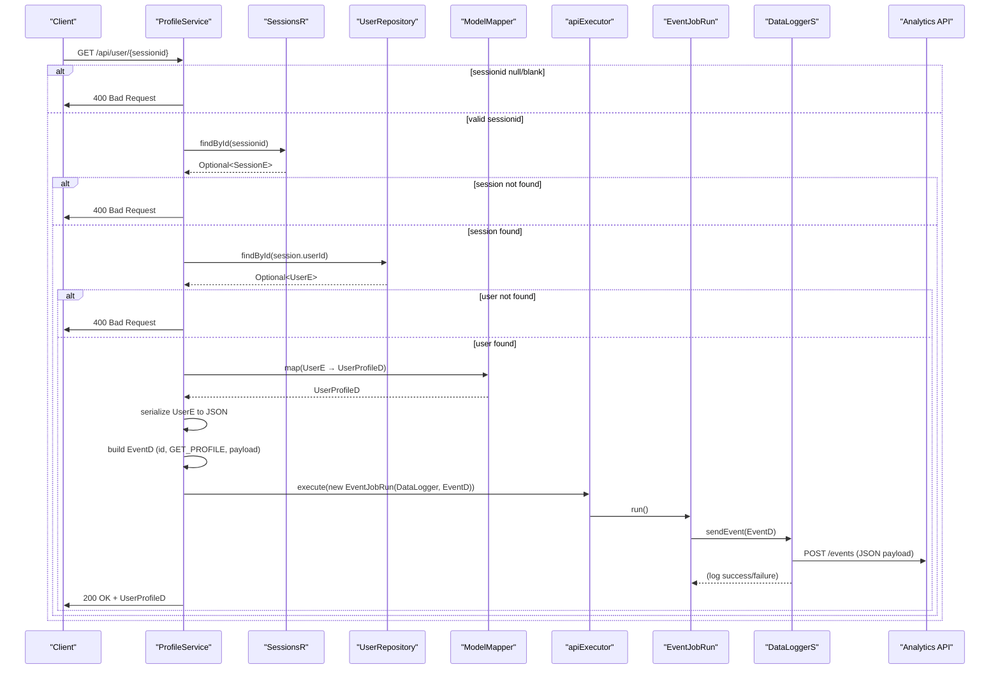

# User Profile Retrieval

## Overview
The User Profile Retrieval feature returns the profile information of a user based on a valid session identifier. It is invoked when a client issues a **GET** request to the `/api/user/{sessionid}` endpoint. The controller looks up the session, resolves the associated user, maps the user entity to a `UserProfileD` DTO, returns that DTO to the caller, and asynchronously logs an analytics event containing the user data.

## Behavior
- **Trigger** – A GET request to `/api/user/{sessionid}` invokes `ProfileService.getProfile`. `src/main/java/ai/privado/demo/accounts/service/controller/ProfileService.java:14`
- **Input validation** – The `sessionid` path variable must be non‑null and not blank; otherwise the method proceeds to the error path. `src/main/java/ai/privado/demo/accounts/service/controller/ProfileService.java:15‑16`
- **Session lookup** – Calls `sesr.findById(sessionid)` to retrieve a `SessionE`. If the optional is empty, the request falls through to the error path. `src/main/java/ai/privado/demo/accounts/service/controller/ProfileService.java:17‑18`
- **User lookup** – Using the `userId` from the found `SessionE`, calls `userr.findById(...)` to retrieve a `UserE`. If the optional is empty, the request falls through to the error path. `src/main/java/ai/privado/demo/accounts/service/controller/ProfileService.java:19‑20`
- **Logging side‑effect** – When a `UserE` is found, the controller:
  1. Serialises the `UserE` to JSON for logging (`objectMapper.writeValueAsString`). `src/main/java/ai/privado/demo/accounts/service/controller/ProfileService.java:22`
  2. Builds an `EventD` with a random UUID, event name `"GET_PROFILE"`, and the same JSON payload. `src/main/java/ai/privado/demo/accounts/service/controller/ProfileService.java:23‑25`
  3. Wraps the event in an `EventJobRun` runnable and submits it to the injected `apiExecutor`. `src/main/java/ai/privado/demo/accounts/service/controller/ProfileService.java:26‑27`
  4. If JSON serialisation fails, logs an error and does **not** abort the request. `src/main/java/ai/privado/demo/accounts/service/controller/ProfileService.java:28‑30`
- **Mapping to DTO** – Uses the injected `ModelMapper` to map the `UserE` entity to a `UserProfileD` DTO, which is returned as the HTTP response body. `src/main/java/ai/privado/demo/accounts/service/controller/ProfileService.java:31`
- **Error handling** – If any of the validation steps fail (null/blank sessionid, missing session, missing user), the method throws a `ResponseStatusException` with HTTP 400 Bad Request. `src/main/java/ai.privado.demo.accounts.service.controller/ProfileService.java:33‑34`

## Triggers / Entry points
- **REST endpoint** – `GET /api/user/{sessionid}` mapped by `@GetMapping("{sessionid}")` in `ProfileService`. `src/main/java/ai/privado.demo.accounts.service.controller/ProfileService.java:13‑14`

## End-to-end flow (Mermaid)

## State / data touched
- **`sessions` table** (via `SessionsR`) – reads a `SessionE` row identified by the supplied `sessionid`. `src/main/java/ai/privado.demo.accounts.service.controller/ProfileService.java:17`
- **`users` table** (via `UserRepository`) – reads a `UserE` row identified by `SessionE.userId`. `src/main/java/ai/privado.demo.accounts.service.controller/ProfileService.java:19`
- **No writes** – the feature only reads; it does not modify any persisted state.

## External dependencies
- **`DataLoggerS`** – injected stub that sends analytics events. Instantiated in `ProfileService` and invoked inside the async job. `src/main/java/ai/privado.demo.accounts.service.controller/ProfileService.java:22‑27`
- **Analytics endpoint** – `https://localhost/analytics/events` called by `DataLoggerS.sendEvent`. `src/main/java/ai/privado.demo.accounts.apistubs.DataLoggerS.java:24‑27`

## Configuration / parameters
- **Analytics base URL** – hard‑coded as `https://localhost/analytics` inside `DataLoggerS`. `src/main/java/ai/privado.demo.accounts.apistubs.DataLoggerS.java:15`
- **Thread pool** – the `ExecutorService` bean named `"ApiCaller"` is injected but its configuration (size, queue) is defined elsewhere (not shown). `src/main/java/ai/privado.demo.accounts.service.controller.ProfileService.java:9‑11`

## Edge cases & failure modes (observed in code)
- **Invalid session identifier** – null or blank leads to immediate 400 response. `src/main/java/ai.privado.demo.accounts.service.controller.ProfileService.java:15‑16`
- **Missing session record** – `sesr.findById` returns empty → 400 response. `src/main/java/ai.privado.demo.accounts.service.controller.ProfileService.java:17‑18`
- **Missing user record** – `userr.findById` returns empty → 400 response. `src/main/java/ai.privado.demo.accounts.service.controller.ProfileService.java:19‑20`
- **JSON processing error** – caught, logged, but request still proceeds to return the DTO. `src/main/java/ai.privado.demo.accounts.service.controller.ProfileService.java:28‑30`
- **Analytics call failure** – `DataLoggerS.sendEvent` logs an error if HTTP status ≠ 200 or if an exception occurs; the async job does not retry or affect the HTTP response. `src/main/java/ai.privado.demo.accounts.apistubs.DataLoggerS.java:30‑34`

## Open questions
- **`BaseE` definition** – `UserE` extends `BaseE`, but the fields (e.g., primary key `id`) and any audit columns are not visible in the provided sources. (`src/main/java/ai.privado.demo.accounts.service.entity.UserE.java:3`)
- **`EventD` structure** – The DTO used for analytics events is referenced but its fields and any validation are not shown. (`src/main/java/ai.privado.demo.accounts.service.controller.ProfileService.java:22`)
- **Thread‑pool configuration** – The concrete properties of the `ExecutorService` bean named `"ApiCaller"` (size, rejection policy) are defined elsewhere (likely in a Spring configuration class). (`src/main/java/ai.privado.demo.accounts.service.controller.ProfileService.java:9‑11`)
- **Session entity details** – The `SessionE` class (fields, expiration logic) is not included, so we cannot tell how session validity is enforced beyond existence. (`src/main/java/ai.privado.demo.accounts.service.controller.ProfileService.java:18`)